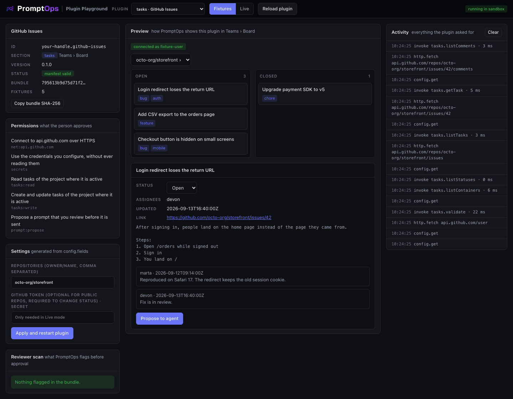

<p align="center">
  <a href="https://promptops.it">
    <picture>
      <source media="(prefers-color-scheme: dark)" srcset="docs/brand/promptops-wordmark-dark.png">
      
    </picture>
  </a>
</p>

<h1 align="center">Modelli di plugin</h1>

<p align="center">
  Un plugin di partenza per ogni sezione di PromptOps, più un playground grafico per provarlo nel browser.<br>
  Non c'è nulla da installare.
</p>

<p align="center">
  <a href="#provalo-in-un-minuto">Provalo</a> ·
  <a href="#scegli-la-sezione">Sezioni</a> ·
  <a href="#crea-il-tuo-plugin">Crea il tuo</a> ·
  <a href="docs/CONTRACTS.md">Contratti</a> ·
  <a href="docs/SECURITY.md">Sicurezza</a> ·
  <a href="README.md">English</a>
</p>



## Provalo in un minuto

Serve [Node.js](https://nodejs.org) 18 o successivo. Non c'è nessun `npm install`.

```bash
git clone https://github.com/shellonback/promptops-plugin-templates.git
cd promptops-plugin-templates
node playground/server.mjs
```

Apri **http://127.0.0.1:4173** e scegli una sezione dal menu in alto.

| Area | Cosa mostra |
|---|---|
| **Sinistra** | Il manifest, i permessi che la persona approva, il form delle impostazioni generato dal manifest e ciò che segnala la scansione del revisore PromptOps |
| **Centro** | L'anteprima di come PromptOps disegna i dati del tuo plugin in quella sezione |
| **Destra** | Ogni richiesta fatta dal plugin, comprese quelle negate e il motivo |

Il plugin gira nella stessa sandbox di PromptOps: niente rete, niente storage, nessun accesso alla pagina. L'unica uscita è l'oggetto `sdk`.

## Scegli la sezione

Un plugin appartiene a una sola sezione. Parti dal modello di quella sezione.

| Sezione | Modello | Cosa fornisce il plugin | Dove compare in PromptOps |
|---|---|---|---|
| `tasks` | [templates/tasks](templates/tasks) | Task da un tracker | Teams › Board |
| `code` | [templates/code](templates/code) | Pull request e check della CI | Sessions › Git Explorer |
| `data` | [templates/data](templates/data) | Tabelle da un'API o da un servizio dati | Sessions › pannello laterale |
| `providers` | [templates/providers](templates/providers) | Credito e quota di un provider AI | Usage |
| `context` | [templates/context](templates/context) | Documenti da usare come contesto | Prompts › Project Brief |
| `notify` | [templates/notify](templates/notify) | Messaggi inviati quando succede qualcosa | Notifications |
| `agent` | [templates/agent](templates/agent) | Skill e azioni rapide, senza codice | Composer di spawn |
| `pages` | [templates/pages](templates/pages) | Uno strumento con la sua pagina, descritta come dati | Una voce propria nel menu laterale |

Nomi dei metodi, argomenti e forme di ritorno sono in [docs/CONTRACTS.md](docs/CONTRACTS.md).

## Crea il tuo plugin

**1. Copia un modello.** Scegli sezione, cartella, id e nome.

```bash
node tools/new-plugin.mjs tasks ../mio-plugin acme.linear-tasks "Linear"
```

L'id è `tuo-handle.slug-del-plugin`. L'handle è quello del tuo profilo publisher in PromptOps e non cambia mai.

**2. Aprilo nel playground.**

```bash
node playground/server.mjs --plugin ../mio-plugin
```

**3. Modifica tre file.** Dopo ogni modifica premi **Reload plugin**.

| File | Cosa cambiare |
|---|---|
| `promptops-plugin.json` | Nome, descrizione, host che chiami, impostazioni che la persona compila |
| `src/plugin.js` | Le chiamate al tuo servizio e la conversione nelle forme di PromptOps |
| `fixtures.json` | Risposte di esempio del tuo servizio, così il plugin funziona offline. Aggiungi un oggetto `config` per precompilare le impostazioni che servono al plugin, come un sito o un id di workspace. Mai segreti |

**4. Controllalo.**

```bash
node tools/validate.mjs ../mio-plugin
```

Esegue gli stessi controlli di PromptOps e stampa i valori che ti servono al passo 6.

**5. Provalo dentro PromptOps.** Apri **Plugins › Installed**, attiva **Developer mode**, incolla il percorso della cartella e premi **Link folder**. Il plugin gira nella sandbox vera.

**6. Pubblicalo.**
1. Carica il plugin in un **repository GitHub pubblico**. Il codice deve essere pubblico: PromptOps lo revisiona e chiunque può leggerlo.
2. In PromptOps apri **Plugins › Create plugin**. Pubblica a nome tuo o di un team che amministri.
3. Premi **Submit for review** e incolla versione, commit SHA, SHA-256 del bundle e manifest stampati da `validate.mjs`.
4. Un admin di PromptOps scansiona il codice a quel commit esatto e approva o rifiuta. Gli aggiornamenti seguono lo stesso percorso, e la versione attiva resta pubblicata finché l'aggiornamento non è approvato.

## Le regole

Cosa **può** fare un plugin, solo se il manifest lo chiede e la persona approva:

- Chiamare in HTTPS gli host elencati in `permissions`, una voce per host: `net:api.example.com`.
- Usare credenziali tramite i segnaposto `{{secret:chiave}}`. Il plugin non vede mai il valore.
- Tenere un piccolo storage locale, mostrare una notifica, proporre un prompt che la persona rivede.

Cosa **non può mai** fare:

- Leggere prompt, risposte degli agenti, file, terminale o account PromptOps.
- Avviare un programma, caricare codice da internet o parlare con un host non dichiarato.
- Inviare qualcosa a un agente da solo. Il plugin propone, la persona decide.
- Portare una propria interfaccia. Restituisce dati e PromptOps li disegna.

Dettagli in [docs/SECURITY.md](docs/SECURITY.md).

## Fixtures e Live

| Modalità | Cosa succede | Quando usarla |
|---|---|---|
| **Fixtures** | Le richieste ricevono risposta da `fixtures.json`. Niente internet. I segreti dichiarati contano come impostati | Costruire la conversione, schermate, demo |
| **Live** | Richieste HTTPS vere, con le stesse regole dell'app: solo host dichiarati, niente indirizzi interni, niente redirect | Verifica con il servizio reale. I segreti si scrivono nel riquadro Settings |

I segreti scritti nel playground restano nella scheda del browser e nella memoria del server locale. Non vengono mai salvati su disco.

## Dove vive cosa

| Repository | Di chi è | Cosa contiene |
|---|---|---|
| Questo | PromptOps | I sette modelli, il playground, gli strumenti e i contratti |
| Il tuo plugin | **Tuo** | Solo il tuo plugin: `promptops-plugin.json`, `src/plugin.js`, `fixtures.json`, il tuo README |

I sette modelli stanno in **un solo repository di proposito**. Condividono playground, copia dell'SDK, regole e strumenti, quindi non possono divergere, e una modifica a un contratto li aggiorna tutti con un solo commit.

`tools/new-plugin.mjs` crea il tuo repository a partire da un modello. La nuova cartella è autonoma, ha un suo README e la pubblichi sotto il tuo account. Per provarla punti il playground su di lei con `--plugin`.

Se tieni più plugin in un tuo repository, dai a ognuno la sua cartella e compila **Subfolder** all'invio.

## Cosa funziona oggi in PromptOps

| Parte | Stato |
|---|---|
| Sandbox, permessi, segreti, storage, notifiche, proposte di prompt | Funzionano nell'app desktop |
| Chiamata del contratto di sezione dall'app | Funziona. Si prova in **Plugins › Installed › Test contract** |
| Schermate di sezione che disegnano i tuoi dati: board, usage, esploratori | In collegamento. Fino ad allora il riferimento grafico è il playground |
| Skill e azioni rapide di `agent` | Per ora solo nel playground |
| Pagine di `pages`: voce di menu, repository, salvataggio in `docs/`, Claude senza strumenti | Funzionano nell'app desktop su macOS. Linux da verificare, Windows non ancora per `ai:generate` |

I contratti sono alla versione 0 e possono ancora cambiare prima dell'uscita delle schermate di sezione.

## Licenza

Il codice è MIT. Vedi [LICENSE](LICENSE).

Il nome e i loghi PromptOps in `docs/brand/` sono marchi del rispettivo titolare. Sono qui perché i plugin possano dichiarare di essere fatti per PromptOps. La licenza MIT non li copre.
