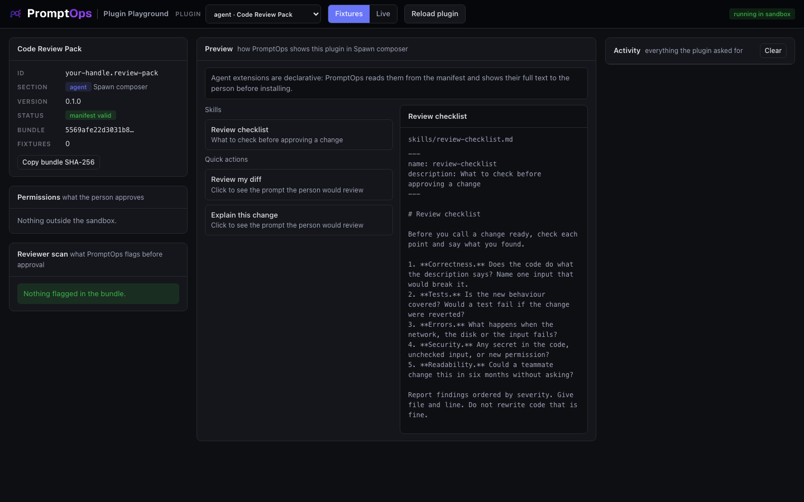

<a href="../../README.md"></a>

# agent template: Code Review Pack

Adds a skill and two quick actions to the **Spawn composer**. This section has no code: everything is in the manifest and in the files it points to.



## Try it

From the root of this repository:

```bash
node playground/server.mjs
```

Open http://127.0.0.1:4173 and choose **agent · Code Review Pack** in the dropdown. It starts in **Fixtures** mode, so it works offline.

## What you implement

| In the manifest | What it adds |
|---|---|
| `contributes.skills[]` with `id`, `title`, `description`, `file` | A skill the person can attach to an agent. `file` is a Markdown file in your plugin |
| `contributes.quickActions[]` with `id`, `title`, `prompt` | A one-click prompt the person reviews before it is sent |

`dist/plugin.js` stays empty on purpose. `entry` is required, and an empty bundle asks for no permission.

Exact shapes: [docs/CONTRACTS.md](../../docs/CONTRACTS.md#agent).

## The three files

| File | What it is |
|---|---|
| `promptops-plugin.json` | The manifest: id, section, hosts, permissions, settings |
| `dist/plugin.js` | The plugin. One file, already built, no dependencies |
| `skills/*.md` | The skills, one Markdown file each |
| `fixtures.json` | Empty: this template makes no requests |

## Make it yours

Copy the template first, so your work lives in its own folder:

```bash
node tools/new-plugin.mjs agent ../my-plugin your-handle.my-plugin "My Plugin"
node playground/server.mjs --plugin ../my-plugin
```

Then:

1. Write your skills as Markdown files in `skills/`. Start each with the `name` and `description` front matter.
2. List them in `contributes.skills`. Keep `description` to one line: it is what people read when choosing.
3. Write quick actions as complete prompts. Say what to do and how to report, not only the topic.
4. Keep `permissions` empty. A pack that asks for network access will be questioned at review.
5. Remember that this text ends up in an agent prompt. PromptOps shows all of it to the person before installing, and the reviewer reads it too.

Press **Reload plugin** after each change. Denied requests appear in red in the Activity log, with the reason.

## Test against the real service

There is nothing to call, so Fixtures and Live behave the same. Click a skill to read it, click a quick action to see the prompt the person would review.

Skills and quick actions are shown in the playground only for now. The app does not install them yet.

## Before you submit

```bash
node tools/validate.mjs ../my-plugin
```

- [ ] `id` starts with your publisher handle and `version` is higher than the published one
- [ ] `permissions` lists every host you call, and nothing you do not use
- [ ] The plugin works in **Live** mode against the real service
- [ ] The Reviewer scan on the left shows nothing you cannot explain
- [ ] The repository is public and the commit you submit is pushed

How to publish: [main README, step 6](../../README.md#make-your-own-plugin).
