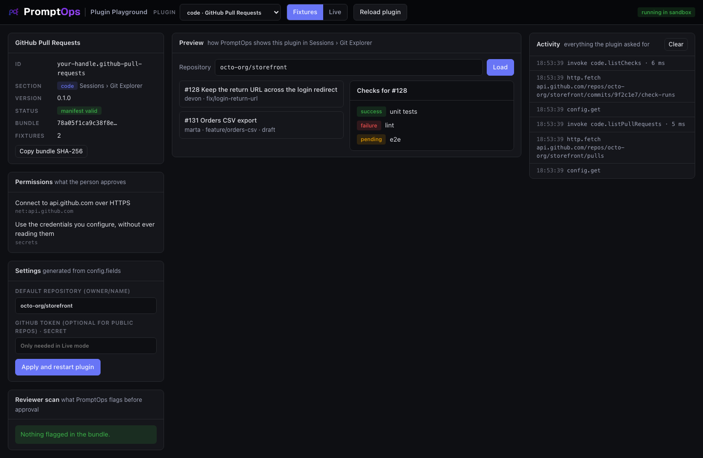

<a href="../../README.md"></a>

# code template: GitHub Pull Requests

Shows open pull requests and their CI checks next to your sessions, in **Sessions › Git Explorer**. Use it as the base for GitLab, Bitbucket or your CI service.



## Try it

From the root of this repository:

```bash
node playground/server.mjs
```

Open http://127.0.0.1:4173 and choose **code · GitHub Pull Requests** in the dropdown. It starts in **Fixtures** mode, so it works offline.

## What you implement

| Method | You return |
|---|---|
| `listPullRequests({ repo, state })` | The pull requests of `owner/name` |
| `listChecks({ repo, ref })` | The checks of a commit, each with `success`, `failure`, `pending` or `neutral` |

This section reads metadata from the hosting service. A plugin cannot read local files or code.

Exact shapes: [docs/CONTRACTS.md](../../docs/CONTRACTS.md#code).

## The three files

| File | What it is |
|---|---|
| `promptops-plugin.json` | The manifest: id, section, hosts, permissions, settings |
| `src/plugin.js` | The source of the plugin. One file of plain JavaScript, no dependencies and no build step: what you read is what runs |
| `fixtures.json` | Sample answers for Fixtures mode. First match wins, `*` matches anything |

## Make it yours

Copy the template first, so your work lives in its own folder:

```bash
node tools/new-plugin.mjs code ../my-plugin your-handle.my-plugin "My Plugin"
node playground/server.mjs --plugin ../my-plugin
```

Then:

1. In `promptops-plugin.json` replace `net:api.github.com` with the host of your service.
2. In `src/plugin.js` rewrite `github()` for your API.
3. Keep `safeRepo()` or write your own check. Never build a URL from input you did not validate.
4. Map your CI states to the four allowed values in `listChecks`.
5. Record real answers into `fixtures.json`.

Press **Reload plugin** after each change. Denied requests appear in red in the Activity log, with the reason.

## Test against the real service

Public repositories work without a token. Type `microsoft/vscode` in the Repository box, switch to **Live** and press **Load**.

## Before you submit

```bash
node tools/validate.mjs ../my-plugin
```

- [ ] `id` starts with your publisher handle and `version` is higher than the published one
- [ ] `permissions` lists every host you call, and nothing you do not use
- [ ] The plugin works in **Live** mode against the real service
- [ ] The Reviewer scan on the left shows nothing you cannot explain
- [ ] The repository is public and the commit you submit is pushed

How to publish: [main README, step 6](../../README.md#make-your-own-plugin).
