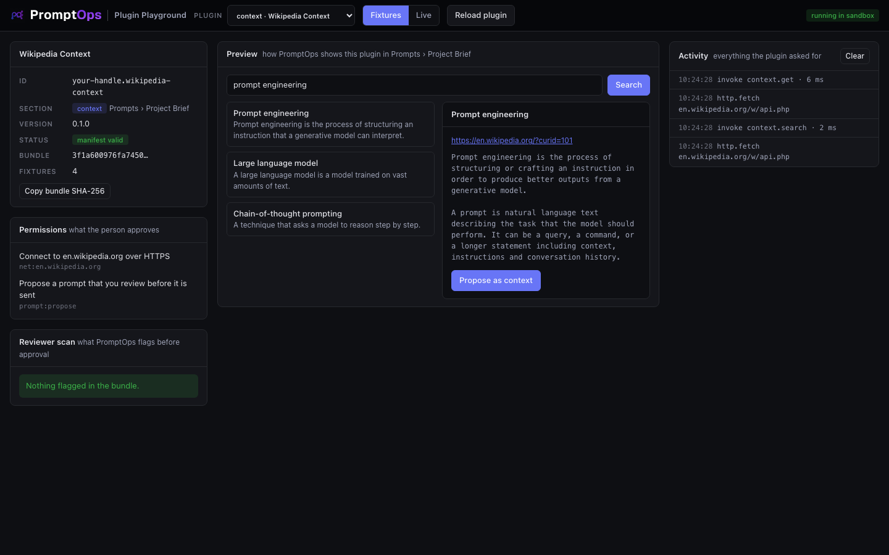

<a href="../../README.md"></a>

# context template: Wikipedia Context

Searches a knowledge source and hands a document to the person as context for their agent, in **Prompts › Project Brief**. Use it as the base for Notion, Confluence, Google Docs or your wiki.



## Try it

From the root of this repository:

```bash
node playground/server.mjs
```

Open http://127.0.0.1:4173 and choose **context · Wikipedia Context** in the dropdown. It starts in **Fixtures** mode, so it works offline.

## What you implement

| Method | You return |
|---|---|
| `search(query)` | Short results: `id`, `title`, `excerpt`, `url` |
| `get(id)` | The full document: `title`, `url`, `content` as plain text or Markdown |

The action `use-as-context` proposes a prompt that contains the document. The person reviews it before anything is sent.

Exact shapes: [docs/CONTRACTS.md](../../docs/CONTRACTS.md#context).

## The three files

| File | What it is |
|---|---|
| `promptops-plugin.json` | The manifest: id, section, hosts, permissions, settings |
| `src/plugin.js` | The source of the plugin. One file of plain JavaScript, no dependencies and no build step: what you read is what runs |
| `fixtures.json` | Sample answers for Fixtures mode. First match wins, `*` matches anything |

## Make it yours

Copy the template first, so your work lives in its own folder:

```bash
node tools/new-plugin.mjs context ../my-plugin your-handle.my-plugin "My Plugin"
node playground/server.mjs --plugin ../my-plugin
```

Then:

1. In `promptops-plugin.json` replace `net:en.wikipedia.org` with the host of your source. Add `secrets` and a `secret` field if it needs a token.
2. In `src/plugin.js` rewrite `wiki()` for your API, then `search` and `get`.
3. Strip HTML from excerpts and content. Keep `content` under 50 000 characters.
4. Keep the wording in `use-as-context` that says where the text comes from and that it is reference material. Text from outside must never read like an instruction to the agent.
5. Record real answers into `fixtures.json`.

Press **Reload plugin** after each change. Denied requests appear in red in the Activity log, with the reason.

## Test against the real service

Wikipedia needs no credentials. Switch to **Live**, type a query and press **Search**.

## Before you submit

```bash
node tools/validate.mjs ../my-plugin
```

- [ ] `id` starts with your publisher handle and `version` is higher than the published one
- [ ] `permissions` lists every host you call, and nothing you do not use
- [ ] The plugin works in **Live** mode against the real service
- [ ] The Reviewer scan on the left shows nothing you cannot explain
- [ ] The repository is public and the commit you submit is pushed

How to publish: [main README, step 6](../../README.md#make-your-own-plugin).
