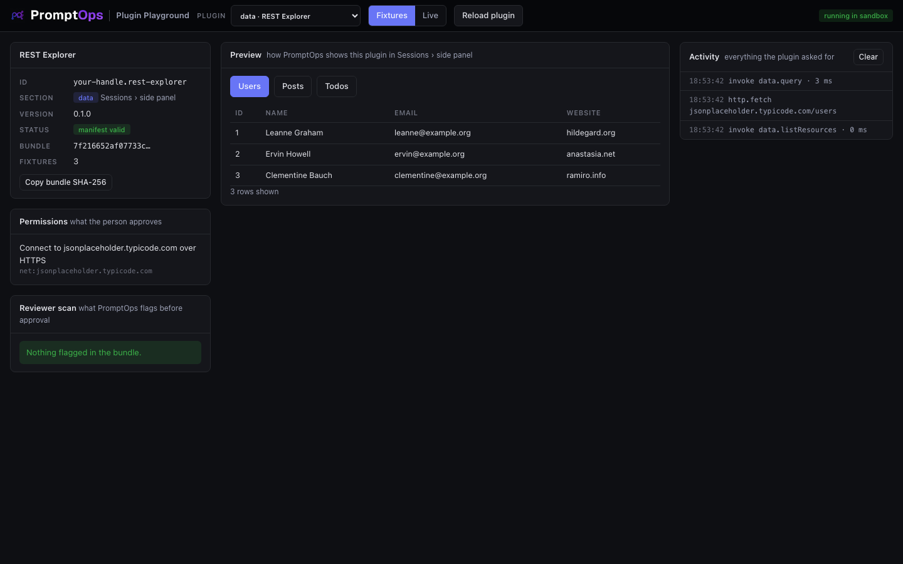

<a href="../../README.md"></a>

# data template: REST Explorer

Browses the resources of an API as tables, in a panel next to your session. Use it as the base for Supabase, Airtable, a metrics service or your internal API.



## Try it

From the root of this repository:

```bash
node playground/server.mjs
```

Open http://127.0.0.1:4173 and choose **data · REST Explorer** in the dropdown. It starts in **Fixtures** mode, so it works offline.

## What you implement

| Method | You return |
|---|---|
| `listResources()` | What can be browsed: tables, collections, endpoints |
| `query({ resourceId, limit, filter })` | `columns`, `rows` and an optional `total` |

You return rows. PromptOps draws the table, so your plugin has no HTML and no CSS.

Exact shapes: [docs/CONTRACTS.md](../../docs/CONTRACTS.md#data).

## The three files

| File | What it is |
|---|---|
| `promptops-plugin.json` | The manifest: id, section, hosts, permissions, settings |
| `dist/plugin.js` | The plugin. One file, already built, no dependencies |
| `fixtures.json` | Sample answers for Fixtures mode. First match wins, `*` matches anything |

## Make it yours

Copy the template first, so your work lives in its own folder:

```bash
node tools/new-plugin.mjs data ../my-plugin your-handle.my-plugin "My Plugin"
node playground/server.mjs --plugin ../my-plugin
```

Then:

1. In `promptops-plugin.json` replace the host with the one of your API. Add `secrets` and a `secret` field if it needs a key.
2. In `dist/plugin.js` describe your resources in `RESOURCES`: name, description, columns.
3. Rewrite the request in `query()`. Always cap the number of rows with `limit`.
4. Pick only the columns you need: every value is shown to the person as text.
5. Record real answers into `fixtures.json`.

Press **Reload plugin** after each change. Denied requests appear in red in the Activity log, with the reason.

## Test against the real service

The demo API needs no credentials. Switch to **Live** and press a resource.

## Before you submit

```bash
node tools/validate.mjs ../my-plugin
```

- [ ] `id` starts with your publisher handle and `version` is higher than the published one
- [ ] `permissions` lists every host you call, and nothing you do not use
- [ ] The plugin works in **Live** mode against the real service
- [ ] The Reviewer scan on the left shows nothing you cannot explain
- [ ] The repository is public and the commit you submit is pushed

How to publish: [main README, step 6](../../README.md#make-your-own-plugin).
