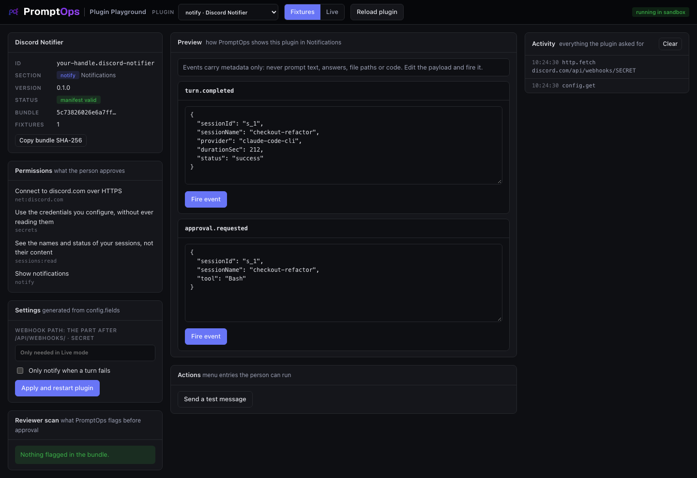

<a href="../../README.md"></a>

# notify template: Discord Notifier

Posts a message to a Discord channel when an agent finishes a turn or asks for approval. Use it as the base for Slack, Telegram, Teams, email services or any webhook.



## Try it

From the root of this repository:

```bash
node playground/server.mjs
```

Open http://127.0.0.1:4173 and choose **notify · Discord Notifier** in the dropdown. It starts in **Fixtures** mode, so it works offline.

## What you implement

| You write | When it runs |
|---|---|
| `promptops.events.on('turn.completed', handler)` | An agent finishes a turn |
| `promptops.events.on('approval.requested', handler)` | An agent waits for the person |
| `promptops.actions.register('send-test', handler)` | The person runs the menu entry |

Events carry metadata only: session name, status, duration, tool name. Never prompt text, answers, file paths or code. The full list of events is in [docs/CONTRACTS.md](../../docs/CONTRACTS.md#notify).

Exact shapes: [docs/CONTRACTS.md](../../docs/CONTRACTS.md#notify).

## The three files

| File | What it is |
|---|---|
| `promptops-plugin.json` | The manifest: id, section, hosts, permissions, settings |
| `src/plugin.js` | The source of the plugin. One file of plain JavaScript, no dependencies and no build step: what you read is what runs |
| `fixtures.json` | Sample answers for Fixtures mode. First match wins, `*` matches anything |

## Make it yours

Copy the template first, so your work lives in its own folder:

```bash
node tools/new-plugin.mjs notify ../my-plugin your-handle.my-plugin "My Plugin"
node playground/server.mjs --plugin ../my-plugin
```

Then:

1. In `promptops-plugin.json` replace `net:discord.com` with the host of your service.
2. Keep `sessions:read`: without it your plugin receives no session events.
3. In `src/plugin.js` change `send()`. If the token goes in the URL, keep it as `{{secret:...}}` in the path or query. If it goes in a header, put the placeholder there.
4. Choose the events you need and write one short message for each.
5. Add settings for what people want to tune: only failures, a mention, a channel.

Press **Reload plugin** after each change. Denied requests appear in red in the Activity log, with the reason.

## Test against the real service

Create a webhook in a Discord channel. Copy the part of its URL after `/api/webhooks/` into the Settings card, press **Apply and restart plugin**, switch to **Live** and press **Fire event**. In the Activity log the secret shows as `SECRET`.

## Before you submit

```bash
node tools/validate.mjs ../my-plugin
```

- [ ] `id` starts with your publisher handle and `version` is higher than the published one
- [ ] `permissions` lists every host you call, and nothing you do not use
- [ ] The plugin works in **Live** mode against the real service
- [ ] The Reviewer scan on the left shows nothing you cannot explain
- [ ] The repository is public and the commit you submit is pushed

How to publish: [main README, step 6](../../README.md#make-your-own-plugin).
