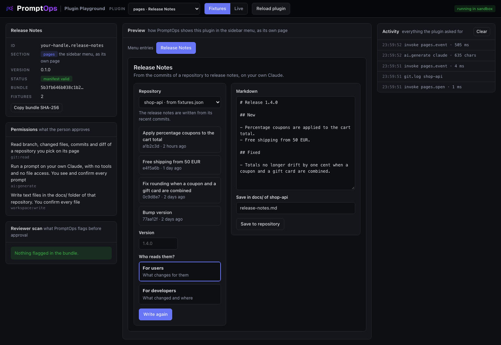

<a href="../../README.md"></a>

# pages template: Release Notes

Adds an entry to the PromptOps menu. The page behind it turns the recent commits of a repository into release notes and saves them in `docs/`. Use it as the base for any tool with its own page: writers, reports, checklists, generators.



## Try it

From the root of this repository:

```bash
node playground/server.mjs
```

Open http://127.0.0.1:4173 and choose **pages · Release Notes** in the dropdown. Pick the repository, press **Write release notes** and confirm the prompt. It starts in **Fixtures** mode, so it works offline: the commits and the answer of the model come from `fixtures.json`.

## The idea: your page is data

Your plugin never draws anything. It returns a description of the page and PromptOps draws it, with its own look, in light and dark.

```js
return {
  title: 'Release Notes',
  blocks: [
    { type: 'field', kind: 'repo', id: 'repo', label: 'Repository', live: true },
    { type: 'actions', items: [{ id: 'generate', label: 'Write release notes', style: 'primary' }] },
  ],
};
```

No HTML, no CSS and no script ever comes from a plugin. Every value is shown as text.

## What you implement

| You write | When it runs | It returns |
|---|---|---|
| `open(pageId, context, sdk)` | The person opens the menu entry | The page |
| `event(pageId, event, sdk)` | The person clicks a button, or changes a `live` field | The page, after your work |

`event.values` holds the whole form, keyed by field id. All the blocks and field kinds are in [docs/CONTRACTS.md](../../docs/CONTRACTS.md#pages).

## What the person always decides

| Your call | What PromptOps does first |
|---|---|
| `sdk.git.log(repo)` | Nothing to confirm, but `repo` exists only because the person picked that repository on your page. You never see a path |
| `sdk.ai.generate({ prompt })` | Shows the full prompt. Runs it only on a yes, on the person's own Claude, with no tools |
| `sdk.workspace.writeFile(repo, 'docs/x.md', text)` | Shows the full file. Writes it only on a yes, and only under `docs/` |

A "no" rejects the call with an error that starts with `user_denied`. The template turns it into a calm notice, not an error.

## The three files

| File | What it is |
|---|---|
| `promptops-plugin.json` | The manifest: id, the menu entry, permissions |
| `src/plugin.js` | The source of the plugin. One file of plain JavaScript, no dependencies and no build step: what you read is what runs |
| `fixtures.json` | The sample repository under `git`, and sample answers of the model under `ai`. The first `ai` entry whose `match` is inside the prompt wins |

## Make it yours

Copy the template first, so your work lives in its own folder:

```bash
node tools/new-plugin.mjs pages ../my-plugin your-handle.my-plugin "My Plugin"
node playground/server.mjs --plugin ../my-plugin
```

Then:

1. In `promptops-plugin.json` name your menu entry: `title`, 40 characters at most, and a [Tabler icon](https://tabler.io/icons).
2. Keep only the permissions you use. A page that needs no repository needs none of the three.
3. In `src/plugin.js` change `view()`: it is the whole page, built from your state.
4. In `event()` react to the button ids you declared, update the state and return `view()` again.
5. Change `prompt()`. Say what you want back and nothing else: the model answers with text only.

Press **Reload plugin** after each change. If PromptOps would drop one of your blocks, the playground says which one and why.

## Test with the real model

Switch to **Live** and press the button again. The playground runs the `claude` CLI of this machine exactly as PromptOps does: no tools, no MCP servers, an empty folder. The repository still comes from `fixtures.json`, and nothing is ever written to disk: the playground shows you the file instead.

## Good to know

- Your state lives inside the sandbox for as long as PromptOps is open. Use `sdk.storage` with the `storage` permission for what must survive a restart.
- You have ten minutes to answer an event. For long work, call `sdk.pages.update(pageId, view)` with a `progress` block while you go.
- `git:read` together with a `net:` permission lets repository content leave the device. It is allowed, the reviewer will look at what you send.
