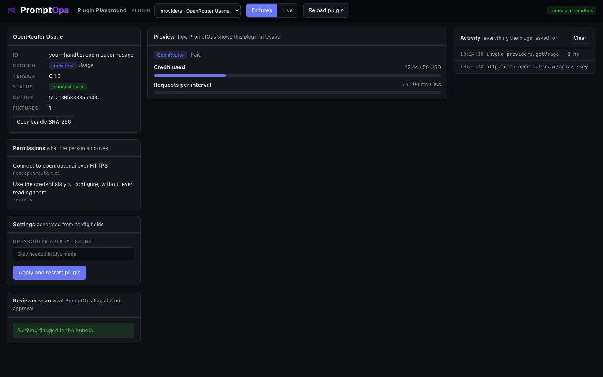

<a href="../../README.md"></a>

# providers template: OpenRouter Usage

Shows how much of your OpenRouter credit is used, in the **Usage** section. Use it as the base for any AI provider that exposes credit or quota over HTTPS.



## Try it

From the root of this repository:

```bash
node playground/server.mjs
```

Open http://127.0.0.1:4173 and choose **providers · OpenRouter Usage** in the dropdown. It starts in **Fixtures** mode, so it works offline.

## What you implement

| Method | You return |
|---|---|
| `getUsage()` | `provider`, an optional `plan`, and a list of `meters` |

Each meter is `{ id, label, used, limit, unit, resetsAt? }`. Use `limit: null` when the provider reports no limit.

A plugin cannot start a CLI or read local files. This section covers what a provider exposes over HTTPS.

Exact shapes: [docs/CONTRACTS.md](../../docs/CONTRACTS.md#providers).

## The three files

| File | What it is |
|---|---|
| `promptops-plugin.json` | The manifest: id, section, hosts, permissions, settings |
| `src/plugin.js` | The source of the plugin. One file of plain JavaScript, no dependencies and no build step: what you read is what runs |
| `fixtures.json` | Sample answers for Fixtures mode. First match wins, `*` matches anything |

## Make it yours

Copy the template first, so your work lives in its own folder:

```bash
node tools/new-plugin.mjs providers ../my-plugin your-handle.my-plugin "My Plugin"
node playground/server.mjs --plugin ../my-plugin
```

Then:

1. In `promptops-plugin.json` replace `net:openrouter.ai` with the host of your provider and rename the `apiKey` field if you like.
2. In `src/plugin.js` change the request. Keep the key as `{{secret:apiKey}}`: your code never sees it.
3. Turn the answer into meters. One meter per thing the person cares about: credit, requests, tokens.
4. Handle `401` with a clear message: it is the most common failure.
5. Record a real answer into `fixtures.json`, with the key label removed.

Press **Reload plugin** after each change. Denied requests appear in red in the Activity log, with the reason.

## Test against the real service

Type an OpenRouter API key in the Settings card, press **Apply and restart plugin**, then switch to **Live**.

## Before you submit

```bash
node tools/validate.mjs ../my-plugin
```

- [ ] `id` starts with your publisher handle and `version` is higher than the published one
- [ ] `permissions` lists every host you call, and nothing you do not use
- [ ] The plugin works in **Live** mode against the real service
- [ ] The Reviewer scan on the left shows nothing you cannot explain
- [ ] The repository is public and the commit you submit is pushed

How to publish: [main README, step 6](../../README.md#make-your-own-plugin).
